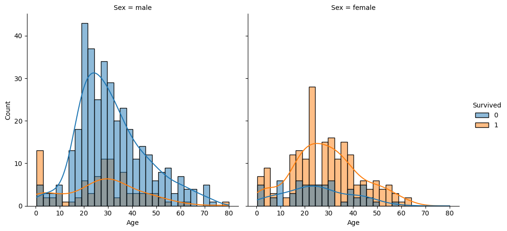

# Titanic Survival Prediction - Machine Learning Model

The Titanic Survival Prediction project builds a machine learning model that predicts survival chances based on passenger information. Using multiple classification algorithms, including Random Forest, Logistic Regression, KNN, and SVM, we analyze key factors that influenced survival rates.

[Model App Link.](https://titanic-ml-app-sy98kkydvazjkqkwzqcmyg.streamlit.app/)
## Dataset Overview

The dataset contains information on Titanic passengers, with features such as:

- **Survived:** Survival (0 = No, 1 = Yes)
- **Pclass:** Ticket class (1 = 1st, 2 = 2nd, 3 = 3rd)
- **Sex:** Gender
- **Age:** Age in years
- **SibSp:** Number of siblings/spouses aboard
- **Parch:** Number of parents/children aboard
- **Fare:** Passenger fare
- **Cabin:** Cabin number
- **Embarked:** Port of Embarkation (C = Cherbourg, Q = Queenstown, S = Southampton)

## Data Preprocessing
To ensure high-quality input data for our models, we performed the following steps:
- Handled missing values:
- Cabin: Replaced NaN with 0, available values as 1.
- Age: Filled missing values using a Random Forest Regressor.
- Applied One-Hot Encoding for categorical variables (Sex, Embarked).
- Created a new feature: family_group = SibSp + Parch (family size).
- Handled outliers using statistical techniques.
- Applied np.log1p() transformation to Fare to reduce skewness.
After preprocessing, we obtained a clean and structured dataset for model training.

##  Model Training

We trained multiple machine learning models:
- Random Forest
- Logistic Regression
- K-Nearest Neighbors (KNN)
- Support Vector Machine (SVM)

## Model Evaluation
Below are the accuracy scores and classification reports for each model:

Below are the accuracy scores and classification reports for each model:

| Model               | Accuracy | Precision | Recall | F1-score |
|---------------------|----------|-----------|--------|----------|
| Random Forest       | 84.48%   | 85%       | 81%    | 82%      |
| Logistic Regression | 85.06%   | 84%       | 82%    | 83%      |
| KNN                 | 84.48%   | 83%       | 82%    | 83%      |
| SVM                 | 82.75%   | 83%       | 78%    | 80%      |

Among these models, Random Forest performed best after hyperparameter tuning.

## Ensemble Learning
To improve accuracy, we built an Ensemble Model using Stacking:
- Base Models: Random Forest, Logistic Regression, KNN, and SVM
- Meta Model: Logistic Regression
Performance of the Stacking Classifier:
- Test Accuracy: **86.21%**
- Cross-Validation Accuracy: **83.01%**
This approach helped combine strengths of multiple models for better generalization.

## Key Insights from Data Analysis
The analysis of the Titanic dataset revealed several important patterns that influenced passenger survival:

- **Gender:** Female passengers had a significantly higher survival rate than males. This supports the "women and children first" evacuation policy that was reportedly followed during the disaster. Gender emerged as one of the most influential predictive features in the model.

- **Passenger Class (Pclass):** Passengers in 1st class had a much better chance of survival compared to those in 2nd and especially 3rd class. This highlights how socio-economic status played a crucial role in access to lifeboats and early rescue efforts.

- **Age:** Younger passengers, particularly children, had higher survival rates. This trend aligns with historical rescue efforts that prioritized saving children along with women.

- **Embarkation Port (Embarked):** Passengers who boarded the ship from Cherbourg (Embarked = C) had a slightly higher survival rate. This may correlate with a higher proportion of wealthier passengers boarding at that port.

## Conclusion Summary
These findings align well with historical accounts of the Titanic disaster and provide strong evidence of the social dynamics at play during the tragedy.
Factors such as gender, class, age, and port of embarkation significantly influenced the likelihood of survival, and our model successfully captured these patterns when predicting outcomes.

## License
The Titanic dataset used in this project is sourced from [Kaggle](https://www.kaggle.com/datasets/yasserh/titanic-dataset) and falls under the **CC0 1.0 Universal** (Creative Commons Zero) license.

This means the dataset is public domain, and anyone can use, modify, and distribute it without restrictions.
For more details, refer to the 
[official CC0 1.0 Universal License.](https://creativecommons.org/publicdomain/zero/1.0/)
